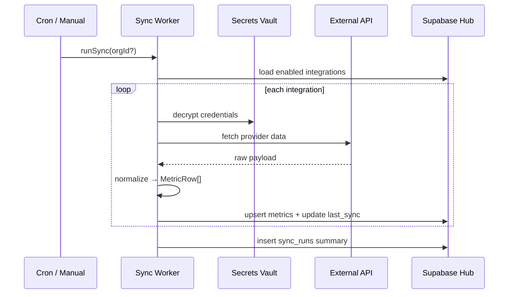

# Helm — Birleşik Ürün Stratejisi, Geçiş Planı ve Pazar Analizi

> **Durum:** v1 — 2026-05-29  
> **Kapsam:** Web + mobile birleşimi, otomatik entegrasyon mimarisi, ticarileştirme, gelir tahmini  
> **Audience:** Ürün kararı + teknik uygulama

## Modüler dokümantasyon

Bu dosya **master özet**. Uygulama detayları ayrı dosyalarda:

| Konu | Dosya |
|------|-------|
| **İndeks** | [docs/README.md](./README.md) |
| Monorepo mimarisi | [architecture/monorepo.md](./architecture/monorepo.md) |
| ADR: neden tek UI değil | [architecture/decisions/001-monorepo-shared-packages.md](./architecture/decisions/001-monorepo-shared-packages.md) |
| Geçiş fazları | [migration/overview.md](./migration/overview.md) |
| **Faz 0 (ilk adım)** | [migration/phase-0-scaffold.md](./migration/phase-0-scaffold.md) |
| Faz 1 API extract | [migration/phase-1-api-extract.md](./migration/phase-1-api-extract.md) |
| Hook envanteri | [migration/hook-inventory.md](./migration/hook-inventory.md) |
| Entegrasyon mimarisi | [integrations/architecture.md](./integrations/architecture.md) |
| Provider spec'leri | [integrations/providers.md](./integrations/providers.md) |
| Pazar + gelir | [business/market-and-revenue.md](./business/market-and-revenue.md) |
| Fiyatlandırma | [business/pricing.md](./business/pricing.md) |

---

## İçindekiler

1. [Executive Summary](#1-executive-summary)
2. [Ürün Vizyonu](#2-ürün-vizyonu)
3. [Mevcut Durum](#3-mevcut-durum)
4. [Hedef Mimari — Monorepo + Shared Packages](#4-hedef-mimari--monorepo--shared-packages)
5. [Geçiş Planı (Fazlar)](#5-geçiş-planı-fazlar)
6. [Otomatik Entegrasyon Mimarisi](#6-otomatik-entegrasyon-mimarisi)
7. [Multi-Tenant ve Ticarileştirme](#7-multi-tenant-ve-ticarileştirme)
8. [Pazar Araştırması](#8-pazar-araştırması)
9. [Gelir Tahmini ve Senaryolar](#9-gelir-tahmini-ve-senaryolar)
10. [Riskler ve Mitigasyon](#10-riskler-ve-mitigasyon)
11. [Başarı Metrikleri (KPI)](#11-başarı-metrikleri-kpi)
12. [Sonraki Adımlar](#12-sonraki-adımlar)

---

## 1. Executive Summary

**Helm**, indie founder ve küçük stüdyoların birden fazla app/property'sini tek cockpit'ten izlemesini sağlayan bir **portfolio operations hub**'dır. Web (kurulum + derin admin) ve mobile (sahada KPI + alert + iOS widget) aynı Supabase hub'a bağlanır.

**Stratejik karar:** Tek UI codebase değil; **tek ürün, iki kabuk, paylaşılan veri katmanı**.

| Boyut | Bugün | Hedef |
|-------|-------|-------|
| Kullanıcı | Tek kişi (Can) | Multi-user org (founder + ops) |
| Dağıtım | TestFlight only | Web SaaS + App Store (mobile Pro) |
| Kod | `helm` web + `helm-mobile` ayrı | Monorepo: `apps/web`, `apps/mobile`, `packages/*` |
| Entegrasyon | Manuel / hub-side | OAuth + API key wizard, otomatik sync |
| Gelir | $0 | Hedef: $2K–15K MRR (12–24 ay) |

**Pazar fırsatı:** Genel app analytics pazarı büyük (~$3.2B, 2024) ama kalabalık. Helm'in nişi dar ve savunulabilir: **multi-property indie founder cockpit** — RevenueCat + App Store + AdMob + Sentry + reviews + alerts + mobile widget tek pakette.

---

## 2. Ürün Vizyonu

### 2.1 Problem

Indie founder sabah rutini:

1. RevenueCat → MRR
2. App Store Connect → downloads / proceeds
3. AdMob → ad revenue
4. Sentry → crash spike
5. Store reviews → yeni 1★
6. PostHog / Supabase → DAU

6–12 sekme, birleşik alert yok, mobilde widget yok.

### 2.2 Helm vaadi

> **"Tüm portföyünü 10 saniyede gör. Sorun olunca haberdar ol. Telefondan müdahale et."**

### 2.3 Ürün sınırları (bilinçli)

| Dahil | Dahil değil (v1 commercial) |
|-------|------------------------------|
| Read-heavy cockpit + alert ack | Full BI / SQL explorer |
| Entegrasyon kurulumu (web) | Kendi ETL pipeline builder |
| Review reply (App Store) | Social media scheduling |
| iOS widget + lock screen | Android widget (v2) |
| Audit log (read) | Enterprise SSO / SOC2 (v2+) |

### 2.4 Platform rolleri

```
┌─────────────────────────────────────────────────────────────┐
│                        HELM HUB (Supabase)                   │
│  properties · metrics · alert_events · reviews · sync_runs   │
└───────────────────────────┬─────────────────────────────────┘
                            │
         ┌──────────────────┼──────────────────┐
         ▼                  ▼                  ▼
   Sync Workers        Edge Functions       RLS / Auth
   (cron + webhook)    (OAuth callback)     (multi-tenant)
         │                  │
         ▼                  ▼
┌─────────────────┐  ┌─────────────────┐
│   apps/web      │  │  apps/mobile    │
│ Entegrasyon     │  │ KPI + alerts    │
│ kurulum         │  │ widget          │
│ tablolar        │  │ review reply    │
│ segment edit    │  │ haptics         │
└─────────────────┘  └─────────────────┘
```

---

## 3. Mevcut Durum

### 3.1 helm-mobile (bu repo)

- Expo SDK 54, TanStack Query v5, Supabase anon + RLS
- Build-time env: `EXPO_PUBLIC_HELM_SUPABASE_URL`, `EXPO_PUBLIC_HELM_SUPABASE_ANON_KEY`
- iOS WidgetKit extension (`targets/widget/`)
- ~20 data hook; fetch logic hook içinde (henüz extract edilmemiş)

**Desteklenen provider'lar (okuma tarafı):**

| Provider | Mobile UI | Veri kaynağı (hub) |
|----------|-----------|-------------------|
| `revenuecat` | System health, KPI | `metrics` (mrr, active_subs) |
| `admob` | KPI (ad_revenue) | `metrics` |
| `posthog` | Modül slot | `metrics` / funnel |
| `supabase` | Users, DAU | Edge fn → auth users |
| `sentry` | Errors ekranı | `sentry_issues` veya REST |
| `appstoreconnect` | Reviews, versions | `reviews`, app metadata |
| `resend` | System health | delivery stats |
| `rest` | Generic | custom REST adapter |

**Hub tabloları (mobile'dan infer):**

- `properties`, `brands`, `heartbeats`
- `project_integrations` — provider, enabled, last_sync_*
- `sync_runs` — trigger, ok_count, error_count, ingested
- `metrics` — date, metric, value, project_id
- `alert_events`, `alert_rules`
- `reviews`, `audit` (audit hook mevcut)

### 3.2 helm web (ayrı repo)

- Refine tabanlı masaüstü cockpit (CLAUDE.md referansı)
- Aynı Supabase hub
- Entegrasyon CRUD ve derin admin burada yaşamalı

### 3.3 Teknik borç (birleşim öncesi)

1. `fetch*` fonksiyonları hook'lara gömülü → drift riski
2. `src/types/database.ts` placeholder → gerçek schema yok
3. Single-tenant auth + env
4. Web/mobile duplicate query logic (varsayım — web repo doğrulanmalı)

---

## 4. Hedef Mimari — Monorepo + Shared Packages

### 4.1 Repo yapısı

```
helm/                              # monorepo root (polyrepo'dan evrilir)
├── apps/
│   ├── web/                       # Refine / Next cockpit
│   └── mobile/                    # mevcut helm-mobile taşınır
├── packages/
│   ├── types/                     # Database + domain types
│   ├── api/                       # Saf Supabase fetch (side-effect yok)
│   ├── queries/                   # TanStack queryOptions + queryKeys
│   ├── domain/                    # modules, format, severity, status
│   └── config/                    # staleTime, feature flags
├── supabase/
│   ├── migrations/
│   ├── functions/                 # sync-trigger, oauth-callback
│   └── seed/
├── workers/                       # sync runner (Bun cron veya Edge)
├── docs/
│   └── HELM_PRODUCT_STRATEGY.md   # bu dosya
├── turbo.json                     # opsiyonel
└── package.json                   # workspaces
```

### 4.2 Katman kuralları

| Paket | İçerir | İçermez |
|-------|--------|---------|
| `@helm/types` | Row types, enums, `Database` | React, Supabase client |
| `@helm/api` | `fetchCockpitKpis(client, opts)` | `useQuery`, UI |
| `@helm/queries` | `cockpitKpisQueryOptions` | Platform storage |
| `@helm/domain` | `deriveSeverity`, `TILE_REGISTRY` | Supabase |
| `apps/*` | Hooks (thin), screens, native | Duplicate fetch logic |

### 4.3 Örnek extract pattern

**Önce (mobile hook içinde):**

```typescript
// apps/mobile/src/hooks/use-cockpit-kpis.ts — 230 satır
async function fetchCockpitKpis(propertyId) { ... }
export function useCockpitKpis() { ... }
```

**Sonra:**

```typescript
// packages/api/cockpit-kpis.ts
export async function fetchCockpitKpis(
  client: SupabaseClient<Database>,
  propertyId: SelectedPropertyId,
): Promise<CockpitKpis> { ... }

// packages/queries/cockpit-kpis.ts
export const cockpitKpisKeys = { all: ["cockpit-kpis"] as const, ... };
export function cockpitKpisQueryOptions(client, propertyId) {
  return queryOptions({
    queryKey: [...cockpitKpisKeys.all, propertyId],
    queryFn: () => fetchCockpitKpis(client, propertyId),
    staleTime: 30_000,
  });
}

// apps/mobile — ~15 satır
export function useCockpitKpis() {
  const { propertyId } = usePreferences();
  return useQuery(cockpitKpisQueryOptions(supabase, propertyId));
}
```

### 4.4 Hook → paket eşleme (migration checklist)

| Mobile hook | `@helm/api` modülü | `@helm/queries` | Platform-only |
|-------------|-------------------|-----------------|---------------|
| `use-cockpit-kpis` | `cockpit-kpis.ts` | ✓ | spark variants |
| `use-alerts` / `useAckAlert` | `alerts.ts` | ✓ | — |
| `use-properties` | `properties.ts` | ✓ | — |
| `use-property-list` | `property-list.ts` | ✓ | — |
| `use-reviews` / `useReviewReply` | `reviews.ts` | ✓ | reply sheet UI |
| `use-system-health` | `system-health.ts` | ✓ | PROVIDER_META UI |
| `use-audit` | `audit.ts` | ✓ | — |
| `use-users` / `use-property-dau` | `users.ts` | ✓ | — |
| `use-sentry-issues` | `sentry.ts` | ✓ | — |
| `use-app-versions` | `app-versions.ts` | ✓ | — |
| `use-metric-detail` | `metric-detail.ts` | ✓ | chart (Skia) |
| `use-projects-breakdown` | `projects-breakdown.ts` | ✓ | — |
| `use-segments` | `segments.ts` | ✓ | — |
| `use-fx-rates` | `fx-rates.ts` | ✓ | currency picker |
| `use-auth` | — | — | SecureStore vs cookie |
| `use-widget-sync` | — | — | iOS only |
| `use-format-currency` | uses `@helm/domain/format` | — | prefs |

### 4.5 Shared vs platform UI

**Shared (`@helm/domain`):**

- `ModuleId`, `TILE_REGISTRY`, `tilesForModules`
- `formatCurrency`, `formatRelativeTime`, `deriveSeverity`
- Semantic tokens (renk/spacing) — web Tailwind + mobile NativeWind aynı isimler

**Web-only:**

- Integration wizard, Refine data provider, bulk tables
- OAuth redirect pages
- Billing (Stripe Customer Portal)

**Mobile-only:**

- Widget sync (`widget-sync.ts`, App Group)
- Haptics, bottom sheets, FlashList
- Push notifications (v2)

---

## 5. Geçiş Planı (Fazlar)

### Faz 0 — Karar ve hazırlık (1 hafta)

**Hedef:** Monorepo iskeleti, CI, değişiklik yapmadan taşıma planı onayı.

- [ ] `helm` web repo path'i doğrula; duplicate hook listesi çıkar
- [ ] Monorepo scaffold (`bun workspaces` veya `turbo`)
- [ ] `gen:types` tek kaynak → `packages/types`
- [ ] CI: `typecheck` web + mobile paralel
- [ ] Feature freeze: yeni hook logic doğrudan `packages/api`'ye

**Çıktı:** Boş `packages/api`, `packages/queries`, mobile build hâlâ yeşil.

---

### Faz 1 — API extract (2–3 hafta)

**Hedef:** Mobile hook'ları thin wrapper; davranış değişmez.

**Sıra (risk / bağımlılık):**

1. `format.ts`, `modules.ts` → `@helm/domain`
2. `use-property-list`, `use-fx-rates` (basit, az bağımlılık)
3. `use-cockpit-kpis`, `use-alerts` (core path)
4. `use-properties`, `use-system-health`
5. `use-reviews`, `use-users`, `use-audit`
6. Geri kalan hook'lar

**DoD:**

- [ ] Mobile'da sıfır inline `supabase.from` hook dosyalarında
- [ ] `bun typecheck` temiz
- [ ] Manuel smoke: home KPI, alerts, system health

---

### Faz 2 — Web adopt (2–3 hafta)

**Hedef:** Web duplicate query'leri sil; shared packages import.

- [ ] Web Supabase client → `@helm/api` + `@helm/queries`
- [ ] Refine resource'lar hub tablolarına map (zaten varsa sadece import değişir)
- [ ] Web-only: integration forms kalır, fetch shared olur

**DoD:**

- [ ] Aynı property'de web KPI === mobile KPI (±sync lag)
- [ ] Tek PR'da metric değişikliği iki platformda sync

---

### Faz 3 — Multi-tenant hub (4–6 hafta)

**Hedef:** Tek Supabase projesi → org-scoped RLS veya tenant başına hub (karar aşağıda).

**RLS modeli (önerilen — hosted SaaS):**

```sql
-- Her tabloya org_id
-- JWT claim: org_id
-- policy: auth.jwt() ->> 'org_id' = org_id
```

**Auth:**

- Magic link + org invite (v1)
- OAuth Google (v1.1)

**Mobile runtime config:**

- Build-time env → login sonrası hub URL (tek hosted) veya deep link tenant slug
- v1 commercial: **tek hosted hub**, müşteri kendi Supabase'ini bağlamaz

**DoD:**

- [ ] İki test org birbirinin verisini göremez
- [ ] Signup → empty cockpit → integration wizard

---

### Faz 4 — Otomatik entegrasyon MVP (4–6 hafta)

**Hedef:** 3 provider "tıkla bağla" — RevenueCat, App Store Connect, Sentry.

Detay: [Bölüm 6](#6-otomatik-entegrasyon-mimarisi).

**DoD:**

- [ ] Yeni kullanıcı 15 dk'da ilk KPI görür
- [ ] Sync hata mesajı user-facing (generic) + admin detay

---

### Faz 5 — Ticari lansman (2–4 hafta)

- [ ] Stripe Billing (web)
- [ ] Plan limitleri: property count, integration count, sync frequency
- [ ] Privacy policy, ToS, support email
- [ ] App Store submission (mobile — production profile)
- [ ] Landing page + founding member waitlist

---

### Faz 6 — Büyüme (ongoing)

- Push notifications
- Android app
- Google Play integration
- AI insight layer (opsiyonel, Solex benzeri)

### Zaman çizelgesi (özet)

```
Hafta  0–1   : Faz 0
Hafta  2–4   : Faz 1
Hafta  5–7   : Faz 2
Hafta  8–13  : Faz 3
Hafta 14–19  : Faz 4
Hafta 20–23  : Faz 5
─────────────────────────
Toplam: ~5–6 ay (part-time solo) / ~3 ay (full-time)
```

---

## 6. Otomatik Entegrasyon Mimarisi

### 6.1 Tasarım prensipleri

1. **Normalize early:** Tüm provider'lar → `metrics`, `reviews`, `issues` gibi hub tablolarına yazılır; UI provider bilmez.
2. **Adapter pattern:** Her provider = `connect` + `sync` + `healthCheck`.
3. **Secrets hub'da:** API key'ler `project_integrations.credentials` (encrypted); mobile/web asla raw key görmez.
4. **Idempotent sync:** Upsert by `(project_id, provider, external_id, date)`.
5. **Observable:** Her run → `sync_runs` + integration `last_sync_*`.

### 6.2 Veri modeli (hedef schema)

```sql
-- organizations (multi-tenant root)
create table organizations (
  id uuid primary key default gen_random_uuid(),
  name text not null,
  slug text unique not null,
  plan text not null default 'free',
  created_at timestamptz default now()
);

-- properties (mevcut — org_id eklenir)
alter table properties add column org_id uuid references organizations(id);

-- project_integrations (mevcut genişletme)
-- credentials: pgsodium veya Supabase Vault encrypted jsonb
-- config: provider-specific non-secret (app_id, bundle_id, project_slug)
-- sync_schedule: cron expression veya 'hourly' | '6h' | 'daily'

create type integration_provider as enum (
  'revenuecat', 'admob', 'posthog', 'supabase',
  'sentry', 'appstoreconnect', 'resend', 'rest'
);

create type sync_status as enum ('ok', 'error', 'running', 'pending');

-- sync_runs (mevcut — org scope)
-- trigger: 'cron' | 'manual' | 'webhook' | 'oauth_complete'
```

### 6.3 Adapter interface (workers)

```typescript
// workers/adapters/types.ts
export type IntegrationContext = {
  integrationId: string;
  projectId: string;
  credentials: Record<string, string>; // decrypted in worker only
  config: Record<string, unknown>;
  since?: Date;
};

export type SyncResult = {
  ingested: number;
  ok: number;
  errors: Array<{ code: string; message: string }>;
};

export interface ProviderAdapter {
  provider: IntegrationProvider;
  validateCredentials(ctx: IntegrationContext): Promise<void>;
  sync(ctx: IntegrationContext): Promise<SyncResult>;
  handleWebhook?(payload: unknown): Promise<void>;
}
```

### 6.4 Provider başına bağlantı akışı

#### RevenueCat (API key — en kolay MVP)

```
Web wizard:
  1. Kullanıcı RevenueCat → Project → API Keys → Public/Secret key kopyalar
  2. Helm: property seç → key yapıştır → "Test connection"
  3. Worker: GET /v2/projects/{id}/metrics/overview (veya webhook subscribe)
  4. Normalize → metrics: mrr, active_subs, new_subs, churn_rate
  5. project_integrations.enabled = true, last_sync_status = 'ok'
```

**Otomasyon seviyesi:** Semi-auto (key paste). Full OAuth RevenueCat'te yok.

**Sync sıklığı:** Saatlik (Pro), 6 saat (Starter)

#### App Store Connect (JWT — orta zorluk)

```
Web wizard:
  1. Kullanıcıdan: Issuer ID, Key ID, .p8 private key upload
  2. Helm Edge fn: JWT mint → test API call
  3. App listesi otomatik çekilir → property match / create
  4. Sync jobs:
     - Sales & Trends → proceeds, downloads
     - Customer Reviews → reviews tablosu
     - App Store Versions → versions ekranı
```

**Güvenlik:** .p8 sadece Vault'ta; worker decrypt eder, log'a yazmaz.

#### Sentry (Auth token + org/project slug)

```
  1. User creates Sentry Internal Integration (read-only scopes)
  2. Paste token + org slug + project slug
  3. Sync: unresolved issues, event count → sentry_issues veya metrics
```

#### AdMob (OAuth2 — Google)

```
  1. "Connect Google" OAuth button
  2. Callback Edge fn → refresh token Vault
  3. Sync: AdMob API → ad_revenue metric
```

#### Supabase (property auth users)

```
  1. Target project's service role key OR management API (read-only)
  2. Sync: auth.users count, last_sign_in → DAU hesabı (mevcut mobile logic)
```

**Not:** Müşterinin kendi Supabase'ine bağlanmak BYOK modeli; hosted SaaS v1'de opsiyonel (Enterprise).

#### PostHog (personal API key)

```
  1. Paste project API key + host
  2. Sync: daily active users, funnel steps → metrics
```

#### REST (generic)

```
  1. URL + headers template + JSON path mapping UI
  2. Power user / escape hatch — v1'de beta
```

### 6.5 Sync orchestration



**Worker seçenekleri:**

| Seçenek | Artı | Eksi |
|---------|------|------|
| Supabase Edge Functions + pg_cron | Basit ops | CPU/time limit |
| Bun worker on Fly/Railway | Tam kontrol | Extra infra |
| GitHub Actions cron | Ücretsiz başlangıç | Production için zayıf |

**Öneri v1:** Edge fn trigger + dedicated Bun worker sync heavy job'lar için.

### 6.6 Webhook vs poll

| Provider | Webhook | Poll |
|----------|---------|------|
| RevenueCat | ✓ (REAL_TIME) | fallback hourly |
| Sentry | ✓ issue.created | fallback 6h |
| App Store | ✗ | 6h |
| AdMob | ✗ | daily |
| PostHog | ✗ | daily |

### 6.7 Kullanıcıya görünen "otomatik" UX

**Integration wizard (web) — 3 adım:**

1. **Choose provider** — kart grid (RevenueCat, App Store, …)
2. **Connect** — OAuth veya credential form + inline validation
3. **Confirm** — ilk sync progress bar → KPI preview → "Add alert rule?"

**Health dashboard (web + mobile system ekranı):**

- Provider bazlı grup (mobile'da zaten var: `PROVIDER_META`)
- Status: OK / HATA / BEKLİYOR
- `last_synced_at`, `last_sync_error` (admin'de detay)

**Otomatik alert önerileri (v1.1):**

- İlk sync sonrası: "MRR %10 düşerse uyar" template'i

### 6.8 Hata yönetimi

| Katman | Kullanıcı görür | Log'da |
|--------|-----------------|--------|
| Invalid API key | "Bağlantı başarısız. Key'i kontrol edin." | HTTP 401 body |
| Rate limit | "Sync gecikti, tekrar denenecek." | Retry-After |
| Partial sync | "Bazı metrikler güncel değil." | per-metric error |
| Provider outage | Banner: "RevenueCat geçici unavailable" | incident id |

---

## 7. Multi-Tenant ve Ticarileştirme

### 7.1 Hosting modeli

**v1 önerisi: Hosted hub (Helm Cloud)**

- Müşteri kendi Supabase kurmaz
- Sen operasyonu yönetirsin (migration, backup, sync worker)
- Mobile + web aynı hosted URL'ye login

**v2: BYOK (Bring Your Own Supabase)**

- Enterprise / privacy-conscious
- Helm sadece sync worker + license
- Kurulum karmaşık — fiyat yüksek ($99+)

### 7.2 Fiyatlandırma önerisi

Rakip referansları: Solex $15–29/mo, AppWatch €19–49/mo, Baremetrics $75+/mo (SaaS odaklı).

**Helm planları (öneri):**

| Plan | Fiyat | Property | Integration | Sync | Mobile |
|------|-------|----------|-------------|------|--------|
| **Free** | $0 | 1 | 2 | daily | read-only |
| **Founder** | $19/mo | 3 | 5 | 6h | full + widget |
| **Studio** | $49/mo | 10 | unlimited | hourly | full + widget |
| **Agency** | $99/mo | 25 | unlimited | hourly + webhooks | seats ×3 |

**Founding member:** İlk 50 kullanıcı %50 lifetime (Solex modeli) — erken traction.

**Mobile App Store:** Web subscription ile bundle; standalone IAP opsiyonel ($4.99/mo) ama tercih edilmez (fragmentasyon).

### 7.3 Gelir paylaşımı

- %100 web checkout (Stripe)
- App Store IAP varsa: %85 net (Apple cut) — fiyatı buna göre ayarla

---

## 8. Pazar Araştırması

### 8.1 TAM / SAM / SOM

| Katman | Tanım | Büyüklük |
|--------|-------|----------|
| **TAM** | Global app analytics + mobile measurement | ~$3.2B (2024), CAGR ~23% → $32B (2035)* |
| **SAM** | Indie/solo founder multi-app revenue cockpit | ~$150M–400M (tahmin)** |
| **SOM** | İlk 24 ay ulaşılabilir (TR + global indie EN) | ~$500K–2M ARR potansiyel |

\* Market Research Future, App Analytics Market Report  
\** TAM'ın ~5–12%'si: subscription analytics + indie dashboard segmentleri (Baremetrics, ChartMogul, AppWatch, Solex, Abner vb.)

### 8.2 Rakip haritası

| Ürün | Odak | Fiyat | Helm'den fark |
|------|------|-------|---------------|
| **Baremetrics** | SaaS MRR/churn | $75–1152/mo | App store + ads yok; mobile zayıf |
| **ChartMogul** | Subscription analytics | $100–400+/mo | Enterprise-leaning |
| **Solex** | Solo founder cockpit | $15–29/mo | En yakın rakip; alerts/widget derinliği az |
| **AppWatch** | Multi-store indie apps | €19–49/mo | ASO/downloads; subscription derinliği az |
| **Abner** | Dev solopreneur P&L | ~$20–40/mo (tahmin) | Web analytics ağırlıklı |
| **SaneSales** | Native Mac sales | $24.99 one-time | Tek seferlik; portfolio hub değil |
| **Geckoboard** | TV/dashboard | $175+/mo | Kurumsal; kurulum ağır |
| **Datadog mobile** | Infra APM | Enterprise | Farklı kategori |

### 8.3 Helm diferansiyasyonu (savunulabilir moat)

1. **Multi-property portfolio** — 5 app tek cockpit (Solex/AppWatch yakın ama Helm daha ops-heavy)
2. **Unified alerts + ack** — metric drop → mobile'da tek tap
3. **Review reply in-app** — App Store yanıtı mobilden (niş ama güçlü)
4. **iOS widget + lock screen** — SaneSales/Solex'te yok veya zayıf
5. **Integration health** — sync status transparency (system ekranı)
6. **Audit trail** — kim ne ack'ledi (B2B mini ekip için)

### 8.4 Hedef müşteri profili (ICP)

**Primary:** Solo indie iOS/Android dev, 2–8 app, RevenueCat veya IAP, $2K–50K MRR toplam  
**Secondary:** 2–5 kişilik mini stüdyo, aynı portföy ihtiyacı  
**Anti-ICP:** Enterprise SaaS (Baremetrics yeterli), tek app hobbyist (free tier yeter)

### 8.5 Dağıtım kanalları

| Kanal | CAC tahmini | Not |
|-------|-------------|-----|
| Twitter/X indie dev | Düşük | Build in public |
| Product Hunt | Orta | Launch spike |
| RevenueCat community | Düşük | Integration ortaklığı |
| App Store search | Orta | "app revenue dashboard" |
| SEO "RevenueCat dashboard alternative" | Düşuka (uzun vade) | Blog |

---

## 9. Gelir Tahmini ve Senaryolar

> **Uyarı:** Aşağıdaki rakamlar pazar araştırması + rakip fiyatları + solo SaaS benchmark'larına dayalı **tahmindir**, garanti değildir.

### 9.1 Varsayımlar

- Ortalama plan: **$32/mo blended ARPU** (free → paid conversion sonrası)
- Free → paid conversion: **8–15%**
- Monthly churn (paid): **5–8%** (early stage)
- CAC (organik ağırlıklı): **$15–40**
- LTV (12 ay horizon): **$280–450**

### 9.2 Senaryo tablosu (24 ay)

| Metrik | Konservatif | Orta | İyimser |
|--------|-------------|------|---------|
| **Ay 6 paid users** | 25 | 60 | 150 |
| **Ay 12 paid users** | 80 | 200 | 500 |
| **Ay 24 paid users** | 180 | 550 | 1,400 |
| **Ay 12 MRR** | $2,000 | $6,400 | $16,000 |
| **Ay 24 MRR** | $4,500 | $17,600 | $44,800 |
| **Ay 24 ARR** | $54K | $211K | $538K |

### 9.3 Maliyet yapısı (aylık, orta ölçek ~200 paid user)

| Kalem | Tahmin |
|-------|--------|
| Supabase Pro + compute | $75–250 |
| Sync worker (Fly/Railway) | $50–150 |
| EAS Build + Apple Dev | $30–100 |
| Stripe fees (~3%) | MRR × 0.03 |
| Domain, email, misc | $30 |
| **Toplam infra** | **~$200–500/mo** |

**Break-even:** ~15–20 paid user @ $32 ARPU → **~$480–640 MRR**

### 9.4 Zaman → gelir eğrisi (orta senaryo)

```
Ay 1–3   : $0       (build + beta)
Ay 4–6   : $300–800 MRR   (founding members)
Ay 7–12  : $2K–8K MRR     (PH launch + word of mouth)
Ay 13–24 : $8K–20K MRR    (SEO + integrations marketplace)
```

### 9.5 Upside / downside

**Upside:**

- RevenueCat partner listing
- Agency plan ($99) ile ARPU artışı
- AI insights add-on (+$10/mo)

**Downside:**

- Solex/AppWatch fiyat baskısı
- Apple App Store Connect API değişiklikleri
- Sync reliability → churn spike
- Solo support yükü

### 9.6 "Para kazanır mı?" net cevap

| Soru | Cevap |
|------|-------|
| Side income ($2K–5K/mo)? | **Mümkün** — 12–18 ay, orta execution |
| Full-time gelir ($15K+/mo)? | **Zor ama mümkün** — 500+ paid user, 24+ ay |
| VC-scale ($1M+ ARR)? | **Düşük öncelik** — niş; bootstrap daha uygun |
| Mevcut helm-mobile'ı olduğu gibi store'a atmak? | **Hayır** — gelir beklentisi düşük |

---

## 10. Riskler ve Mitigasyon

| Risk | Olasılık | Etki | Mitigasyon |
|------|----------|------|------------|
| Web/mobile drift | Yüksek | Orta | Shared packages (Faz 1–2) |
| Sync job failure | Orta | Yüksek | Retry, alerting, status UI |
| Credential leak | Düşük | Kritik | Vault, never log secrets |
| Apple review red | Orta | Orta | Clear privacy policy, read-only scope |
| Rakip kopyalar | Orta | Orta | Widget + alerts + hız |
| Scope creep | Yüksek | Orta | Module gate (`enabled_modules`) |
| Solo burnout | Yüksek | Yüksek | Faz disiplini, founding cap |

---

## 11. Başarı Metrikleri (KPI)

### Product

- **TTV (time to value):** signup → ilk KPI < 15 dk
- **Integration success rate:** > 90% first connect
- **Sync freshness:** p95 lag < 2× plan interval
- **Mobile DAU / paid ratio:** > 40%

### Business

- **MRR**, **paid conversion**, **churn**
- **NPS** (ay 6'dan sonra)
- **Support tickets / paid user** < 0.15/mo

### Technical

- `sync_runs.error_count / ok_count` < 5%
- Mobile crash-free sessions > 99.5%
- API p95 query < 500ms (hub)

---

## 12. Sonraki Adımlar

### Hemen (bu hafta)

1. [ ] `helm` web repo ile mobile hook duplicate audit
2. [ ] Monorepo kararı onayla (taşıma vs symlink vs publish packages)
3. [ ] `gen:types` çalıştır — gerçek schema `packages/types`'a

### Kısa vade (2–4 hafta)

4. [ ] Faz 1: `use-cockpit-kpis` + `use-alerts` extract
5. [ ] Integration wizard spec (Figma veya markdown wireframe)
6. [ ] 5 indie founder'a problem interview (Solex kullanıyor musun? ne eksik?)

### Orta vade (2–3 ay)

7. [ ] Faz 3 RLS + signup
8. [ ] RevenueCat + App Store Connect adapter MVP
9. [ ] Founding member waitlist landing

---

## Ek A: Terimler

| Terim | Anlam |
|-------|-------|
| Hub | Helm'in merkezi Supabase veritabanı |
| Property | Tek app/brand/project birimi |
| Integration | Provider bağlantısı (`project_integrations`) |
| Sync run | Toplu veri çekme işi (`sync_runs`) |
| Module | Feature flag (`subscriptions`, `ads`, …) |

## Ek B: Referanslar

- [App Analytics Market — MRFR](https://www.marketresearchfuture.com/reports/app-analytics-market-6602)
- [Baremetrics Pricing](https://baremetrics.com/pricing)
- [Solex — Solo Founder Cockpit](https://www.solex.dev/)
- [AppWatch](https://appwatch.dev/)
- [Abner — Developer Solopreneur Dashboard](https://www.abner.app/)

---

*Bu doküman yaşayan bir strateji belgesidir. Faz tamamlandıkça güncellenmelidir.*
