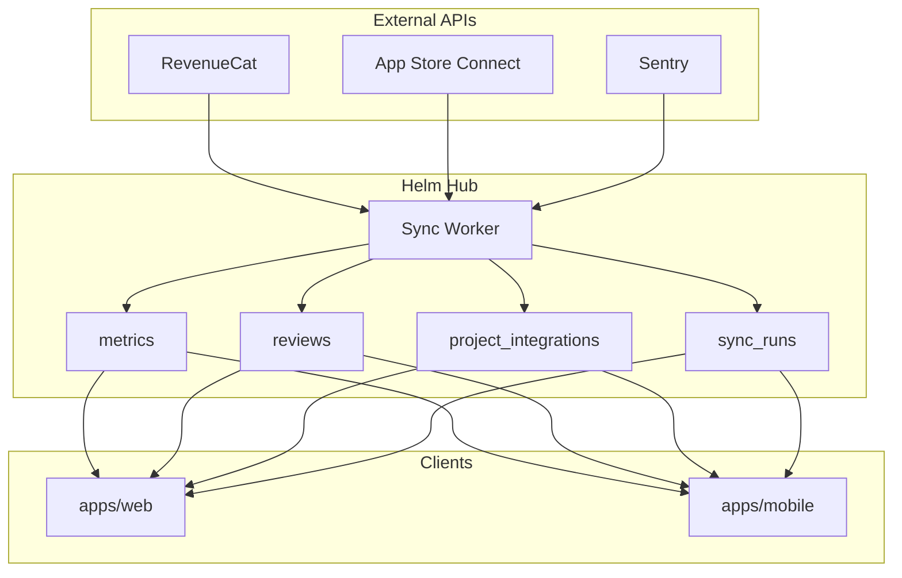
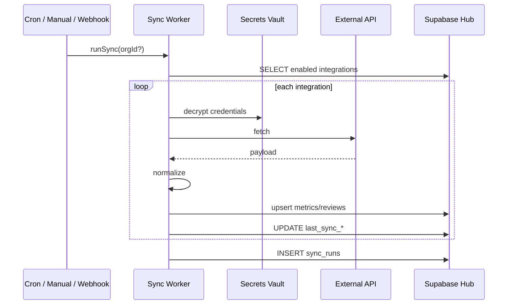

# Entegrasyon Mimarisi

Otomatik entegrasyonların hub üzerinden nasıl çalışacağı.

## Prensipler

1. **Normalize early** - Provider ham verisi UI'a gitmez; `metrics`, `reviews`, `issues` tablolarına yazılır.
2. **Adapter pattern** - Her provider: `validate` + `sync` + opsiyonel `webhook`.
3. **Secrets hub'da** - Credentials encrypted; client (web/mobile) raw key görmez.
4. **Idempotent sync** - Upsert: `(project_id, provider, metric, date)` veya `(external_id)`.
5. **Observable** - Her run → `sync_runs`; integration → `last_sync_*`.

## Veri akışı



## Hub schema (hedef)

```sql
-- Multi-tenant root (Faz 3)
create table organizations (
  id uuid primary key default gen_random_uuid(),
  name text not null,
  slug text unique not null,
  plan text not null default 'free',
  stripe_customer_id text,
  created_at timestamptz default now()
);

-- Mevcut properties - org_id eklenir
alter table properties add column org_id uuid references organizations(id);

-- project_integrations (genişletme)
-- id, project_id, provider, enabled
-- credentials_encrypted bytea  (Vault / pgsodium)
-- config jsonb                 (non-secret: bundle_id, app_id, slug)
-- sync_schedule text           ('hourly' | '6h' | 'daily')
-- last_synced_at, last_sync_status, last_sync_error

-- sync_runs
-- id, org_id, started_at, finished_at, trigger, ingested, ok_count, error_count

-- metrics (normalize)
-- project_id, date, metric, value
-- metric örnekleri: mrr, dau, ad_revenue, active_subs, new_users, total_users
```

## Adapter interface

```typescript
// workers/adapters/types.ts
export type IntegrationProvider =
  | "revenuecat"
  | "admob"
  | "posthog"
  | "supabase"
  | "sentry"
  | "appstoreconnect"
  | "resend"
  | "rest";

export type IntegrationContext = {
  integrationId: string;
  projectId: string;
  orgId: string;
  credentials: Record<string, string>;
  config: Record<string, unknown>;
  since?: Date;
};

export type SyncResult = {
  ingested: number;
  ok: number;
  errors: Array<{ code: string; message: string }>;
};

export interface ProviderAdapter {
  provider: IntegrationProvider;
  validateCredentials(ctx: IntegrationContext): Promise<void>;
  sync(ctx: IntegrationContext): Promise<SyncResult>;
  handleWebhook?(payload: unknown, ctx: IntegrationContext): Promise<void>;
}
```

## Sync orchestration



### Worker hosting (v1 önerisi)

| Bileşen | Teknoloji |
|---------|-----------|
| Light trigger | Supabase Edge Function |
| Heavy sync | Bun worker (Fly.io / Railway) |
| Cron | pg_cron veya worker cron |
| Secrets | Supabase Vault |

## Webhook vs poll

| Provider | Birincil | Fallback |
|----------|----------|----------|
| RevenueCat | Webhook (REAL_TIME) | hourly poll |
| Sentry | Webhook (issue events) | 6h poll |
| App Store Connect | - | 6h poll |
| AdMob | - | daily poll |
| PostHog | - | daily poll |
| Supabase | - | 6h poll |

## Web wizard UX (3 adım)

1. **Choose provider** - kart grid
2. **Connect** - OAuth veya credential form + inline `validateCredentials`
3. **Confirm** - ilk sync progress → KPI preview → opsiyonel alert template

## Health UI (web + mobile)

Mobile'da mevcut: `app/(cockpit)/more/system.tsx`

- Provider grupları (`PROVIDER_META`)
- Status: OK / HATA / BEKLİYOR
- `last_synced_at`, `last_sync_error`

Web'de aynı `@helm/api/system-health` + admin detay (raw error, retry button).

## Hata yönetimi

| Durum | Kullanıcı mesajı | Admin/log |
|-------|------------------|-----------|
| 401 invalid key | Bağlantı başarısız. Key'i kontrol edin. | HTTP body |
| 429 rate limit | Sync gecikti, tekrar denenecek. | Retry-After |
| Partial sync | Bazı metrikler güncel değil. | per-metric errors |
| Provider down | RevenueCat geçici kullanılamıyor. | incident ref |

## Güvenlik checklist

- [ ] Credentials never in client bundle or logs
- [ ] RLS: integration row sadece org member
- [ ] Worker service role - scoped to sync only
- [ ] OAuth tokens refresh otomatik
- [ ] .p8 / private keys Vault'ta; upload sonrası memory clear

## İlgili

- [providers.md](./providers.md) - provider başına spec
- [hook-inventory.md](../migration/hook-inventory.md) - `use-system-health`
