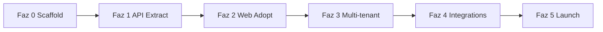

# Geçiş Planı - Genel Bakış

6 fazlı yol haritası. Tahmini süre: **5–6 ay part-time** / **~3 ay full-time**.

## Faz özeti

| Faz | Ad | Süre | Hedef | Doküman |
|-----|-----|------|-------|---------|
| **0** | Scaffold | 1 hf | Monorepo iskelet, CI, types | [phase-0-scaffold.md](./phase-0-scaffold.md) |
| **1** | API extract | 2–3 hf | `@helm/api` + thin hooks | [phase-1-api-extract.md](./phase-1-api-extract.md) |
| **2** | Web adopt | 2–3 hf | Web duplicate sil | - |
| **3** | Multi-tenant | 4–6 hf | RLS, signup, org | - |
| **4** | Integrations MVP | 4–6 hf | RC + App Store + Sentry wizard | [../integrations/providers.md](../integrations/providers.md) |
| **5** | Launch | 2–4 hf | Billing, App Store, landing | - |

## Bağımlılık grafiği

Faz 1 mobile-only tamamlanabilir (web repo olmadan). Faz 2 web repo birleşimini gerektirir.

## Faz 2 - Web adopt (özet)

**Hedef:** Web'deki duplicate Supabase query'leri `@helm/queries` ile değiştir.

**Checklist:**

- [ ] Web Supabase client inject → shared queryOptions
- [ ] Refine list/show resource'ları shared types kullanır
- [ ] Integration formları web'de kalır; health/KPI fetch shared
- [ ] DoD: aynı property'de web KPI === mobile KPI (±sync lag)

**Önkoşul:** `helm` web repo monorepo'ya taşınmış (`apps/web`).

## Faz 3 - Multi-tenant (özet)

**Hedef:** Hosted SaaS - org-scoped RLS.

**Checklist:**

- [ ] `organizations` tablosu + `org_id` tüm hub tablolarında
- [ ] JWT custom claim: `org_id`
- [ ] RLS policy: `auth.jwt()->>'org_id' = org_id`
- [ ] Signup → org create → empty property
- [ ] Magic link auth (v1); Google OAuth (v1.1)
- [ ] Mobile: tek hosted hub URL (build-time env kalkar)

**Karar:** v1 commercial = **hosted hub only** (BYO Supabase = Enterprise v2).

## Faz 4 - Integrations MVP (özet)

**Hedef:** Yeni kullanıcı 15 dk'da ilk KPI.

**MVP provider'lar:** RevenueCat, App Store Connect, Sentry.

Detay: [integrations/providers.md](../integrations/providers.md)

## Faz 5 - Launch (özet)

- [ ] Stripe Billing + plan limit enforcement
- [ ] Privacy policy, ToS
- [ ] Landing + founding member waitlist
- [ ] App Store production submit (mobile)
- [ ] Product Hunt / indie dev kanalları

## Risk kapıları (gate)

Her faz bitmeden sonrakine geçme kriteri:

| Geçiş | Gate |
|-------|------|
| 0 → 1 | `bun typecheck` mobile yeşil; packages boş scaffold var |
| 1 → 2 | Mobile hook'larda sıfır inline `supabase.from` |
| 2 → 3 | Web + mobile aynı KPI değerleri |
| 3 → 4 | İki test org cross-leak yok |
| 4 → 5 | 3 provider connect success rate > 90% (beta) |
| 5 → live | 10 beta user TTV < 15 dk |

## İlgili

- [hook-inventory.md](./hook-inventory.md)
